<!-- =========================================================
     PÂMELA DESIRÉE • GITHUB PROFILE README
     Violet Cyber Theme • PT-BR
========================================================= -->

<!-- BANNER CYBER (SVG ANIMADO) -->

  

<!-- FRASE “ANDANDO” (SVG ANIMADO) -->

  

<!-- BOTÕES TOPO -->

  
  
  

<!-- CONTADORES -->

  
  
  

<h2>🧠 Sobre mim</h2>

<ul>
  <li><b>Atuação:</b> Desenvolvedora <b>Front-End</b> com foco em <b>React</b>, <b>TypeScript</b> e <b>TailwindCSS</b>.</li>
  <li><b>Perfil:</b> Amo construir interfaces <b>modernas, acessíveis</b> e com <b>atenção total aos detalhes</b>.</li>
  <li><b>Diferencial:</b> Tenho formação <b>Full Stack</b>, então entendo o backend e banco — o que facilita integrações e APIs.</li>
  <li><b>Background:</b> Transição do <b>Design</b> para <b>Dev</b> — UI/UX, consistência visual e pixel perfect ✨</li>
</ul>

<pre>
const pamela = {
  cargo: "Desenvolvedora Front-End | React + TypeScript",
  foco: [
    "UI moderna e responsiva",
    "Componentização (React)",
    "Integração com APIs",
    "Acessibilidade e UX"
  ],
  diferencial:
    "Formação Full Stack (Node.js/NestJS + MySQL) para integrar front e backend com mais autonomia."
};
</pre>

  

  Alguns projetos que representam meu foco em interfaces bem construídas, consumo de APIs e organização de código.

<table width="100%" cellspacing="12" cellpadding="0" align="center" style="margin: 0 auto;">
  <tr>
    <td width="33%" valign="top">
      

  <!-- TÍTULO CENTRALIZADO -->
  

    <h3>💊 VitaCare</h3>
    
  

    Front-End de farmácia digital consumindo backend real. Projeto focado em organização, CRUD, UX e integração com API.
  
 

  

    
<b>Stack:</b>

      

        
        
        
        
      

    

  <!-- BOTÃO CENTRALIZADO -->
  

    
  

    
    
    
    
  </td>

  <td width="33%" valign="top">
    

  <!-- TÍTULO CENTRALIZADO -->

  <h3>📝 Blog Pessoal</h3>

  

    Projeto Full Stack com autenticação e CRUD completo. Me deu base forte de integração front + backend e organização em camadas.
  

  
<b>Stack:</b>

  

    
    
    
    
  

  <!-- BOTÃO CENTRALIZADO -->
  

  
  

    
  
  </td>

  <td width="33%" valign="top">
      

  <!-- TÍTULO CENTRALIZADO -->
  

    <h3>✨ Talent Flow</h3>

  

    Plataforma para gestão de talentos com UI moderna e experiência fluida. Meu foco foi front-end: layout, responsividade e componentes.
  

  
<b>Stack:</b>

    

      
      
      
    

  <!-- BOTÃO CENTRALIZADO -->
  

      
  

    
    
    </td>
  

  </tr>
</table>

<h2>🧩 Stack tecnológica</h2>

  <h4>💻 Linguagens</h4>
  

    
  

  <h4>🧱 Backend & Arquitetura</h4>
  

    
  

  

    
    &nbsp;&nbsp;&nbsp;
    
  

  <h4>🎨 Frontend & Design</h4>
  

    
  

  <h4>🗄️ Banco de dados</h4>
  

    
  

  <h4>🧰 Ferramentas</h4>
  

    
  

<h2>📊 Visão geral do GitHub</h2>

  
  

<h2>📈 Atividade & gráficos</h2>

  

<h2>💬✨ Vamos nos conectar</h2>

  Se você curte dev + design com foco em experiência e capricho, vamos trocar uma ideia 👇

  
  

  📧 <b>Email:</b> <a href="mailto:pammreiss@gmail.com">pammreiss@gmail.com</a>

<!-- FOOTER CYBER (SVG ANIMADO) -->

  

